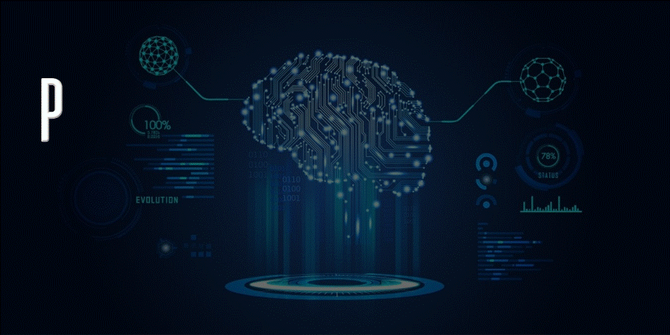

    

# Portafolio Machine Learning Estefany Clara

- :file_folder: **UNIDAD 1: Introducción al aprendizaje Automático**
- :file_folder: **UNIDAD 2: Tratamiento previo de los datos y fundamentos de los algritmos de ML**
- :file_folder: **UNIDAD 3: Algoritmos lineales**
- :file_folder: **UNIDAD 4: Algoritmos no lineales- Naive Bayes, K-NN y feature selection**
- :file_folder: **UNIDAD 5: Aprendizaje no supervizado y metodos de clustering**
- :file_folder: **UNIDAD 6: Ensambles**
- :file_folder: **UNIDAD 7: Ajuste, evaluación y sintonía de modelos**

# Introducción Machine Learning: 

## ¿Qué es el Machine Learning?

## Definición 1: 

“El ‘machine learning’ –aprendizaje automático– es una rama de la inteligencia artificial que permite que las máquinas aprendan sin ser expresamente programadas para ello. Una habilidad indispensable para hacer sistemas capaces de identificar patrones entre los datos para hacer predicciones.”
## Definición 2: 

“Machine learning es una forma de la IA que permite a un sistema aprender de los  datos en lugar de aprender mediante la programación explícita.”
## Definición 3: 

“El machine learning es la ciencia de desarrollo de algoritmos y modelos estadísticos que utilizan los sistemas de computación con el fin de llevar a cabo tareas sin instrucciones explícitas, en vez de basarse en patrones e inferencias. Los sistemas de computación utilizan algoritmos de machine learning para procesar grandes cantidades de datos históricos e identificar patrones de datos. Esto les permite generar resultados con mayor precisión a partir de un conjunto de datos de entrada.”

## Conclusión: 
Podemos decir con estas definiciones que el Machine Learning es una rama de la inteligencia Artificial la cual permite a las maquinas aprender sin ser expresamente programadas para tal tarea; lo hacen mediante el proceso de muchos datos los cuales mediante modelos estadísticos permiten generar resultados identificando los patrones de estos.

## ¿Qué tiene en común y en qué se diferencia de “Inteligencia Artificial”?

La inteligencia Artificial es un concepto más amplio que el Machine Learning, como vimos anteriormente podemos decir que el machine learning es una rama de la IA. Este último utiliza la computación para imitar las funciones de los seres humanos. 
Podemos decir que estas dos tienen en común:
• Automatización y análisis de datos.
• Procesan datos complejos 
• Se basan en modelos matemáticos 

Se diferencian en: 

• Los objetivos: el objetivo de cualquier sistema de IA es que una maquina complete una tarea humana compleja de manera eficiente. Mientras que el Machine Learning es que una maquina analice grandes volúmenes de datos. 
• Los métodos: Mientras que la IA utiliza una gran cantidad de métodos para resolver diferentes problemas. Dentro del machine learning encontramos dos categorías: aprendizaje supervisado y no supervisado. 
• Programación vs. Aprendizaje: en la IA tradicional, los sistemas por lo general son programados de manera explicita para seguir las reglas y diseños de humanos. En el  machine learning, los algoritmos se diseñan para que ellos aprendan patrones a partir de los datos, los modelos se van a ajustar automáticamente para mejorar su rendimiento en función de los datos de entrenamiento.

## ¿Qué tiene en común y en qué se diferencia de “Análisis Estadístico”?

Como vimos los modelos de machine learning brindan predicciones precisas. Este esta basado en la estadística, ya que involucra datos, los cuales son descritos y usados en un marco estadístico. Pero no son lo mismo, la estadística se dedica a analizar los datos de manera minuciosa; el machine learning trata de entender predicciones, crear modelos, pudiendo de esta manera generealizar y ver como se comportan los datos.

## ¿Cómo se diferencia con Data Mining?

El data mining es un subconjunto de la analítica empresarial, en donde se busca en un gran conjunto de datos patrones, relaciones y anomalías. Básicamente los dos se enfocan en aprender de los datos y tomar mejores decisiones. Se diferencian particularmente en la forma en que lo hacen: 
El data mining busca patrones que ya existen en los datos, el machine learning es un aprendizaje automático que va más allá de lo que pasó sino que los resultados se basan en los preexistentes. El primero depende aparte de la intervención humana y de la toma de desiciones. En cambio, en el machine learning el proceso es automático sin intervención humana.

## Aplicaciones

- Asistentes virtuales
- Marketing, publicidad y redes sociales: 
    - Segmentación de la audiencia y personalización de contenido   
    - Recomendación de servicios. 
- Desplazamientos (como GPS) y viajes más eficientes: 
    - Optimización de rutas 
    - Gestión de trafico . 
- Salud 
    - Diagnostico aisistido por computadora
    - Predicción de enfermedades
- Seguridad
    - Detección de amenazas cibernéticas.
    - Comportamiento sospechoso
